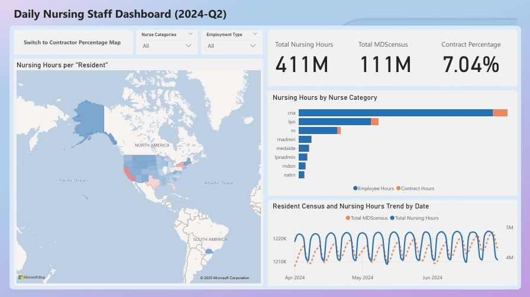
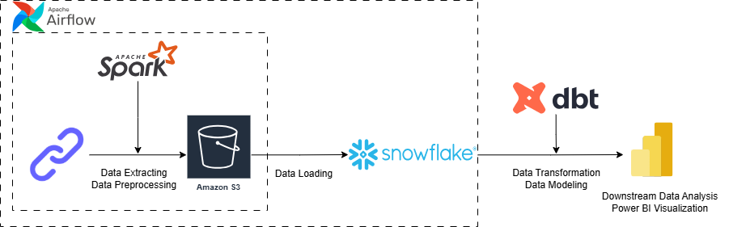
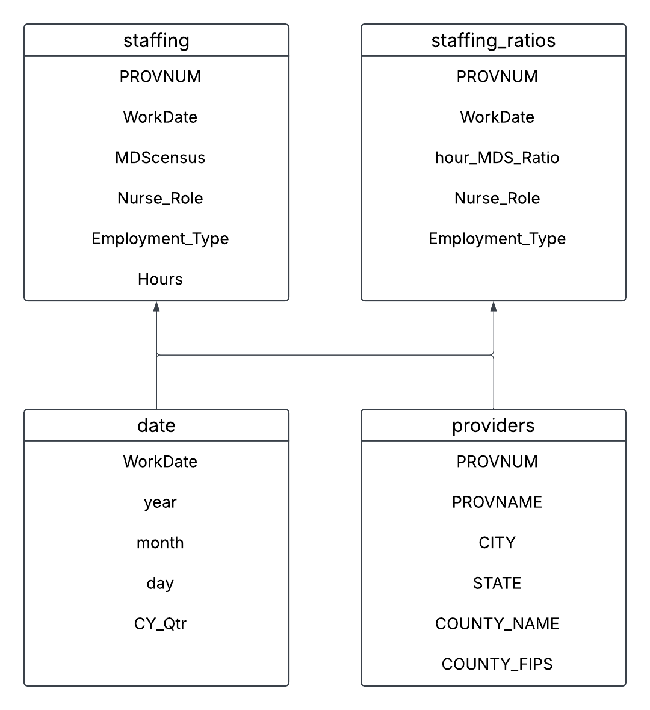

# Nurse Staffing Data Pipeline and Insights for 2024-Q2 Payroll Based Journal
## Project Overview
This is a data engineering and analysis project to help the Nurse Staffing Agency optimize workforce distribution and enhance contract nurse placements across healthcare facilities in the U.S.

In this project, I focused on creating an optimized **ETL (extract, transform, load)** pipeline to process 2024Q2 Payroll-Based Journal (PBJ) Daily Nurse Staffing data. It aims to build an efficient data engineering pipeline using **Apache Spark** to process **130 million+ rows** of data, **AWS S3** for raw data storage, **Snowflake** for cloud-based data warehousing, and **DBT** for data transformation and data modelimg. This data pipeline performs faster than previous data processing workflows. (Previous version: )

The analysis part is supplemented by an interactive **Power BI dashboard** to visualize staffing trends, state-level variations, and the distribution of contract nurses. The report identifies key trends in 2024-Q2 nurse staffing and provides actionable recommendations for improving staffing allocation, supporting more efficient decision-making and better resource utilization across nursing facilities.


## Architecture


In this project, I designed and implemented a scalable ETL (Extract, Transform, Load) pipeline to process and analyze Payroll-Based Journal (PBJ) Daily Nurse Staffing data (2024-Q2). The pipeline automates data ingestion, transformation, and storage, ensuring efficient processing and accessibility for further analysis.

### Pipeline Overview

1. Containerization: To create a reproducible and scalable workflow, I deployed Apache Airflow in a Docker container for workflow orchestration. 

2. Data Ingestion: The ETL pipeline automatically retrieves PBJ staffing data in JSON format from an API using Python and API requests. It is efficiently processed and transformed using Apache Spark to handle large volumes of data and ensure scalability.

3. Data Storage: The raw data is stored in Amazon S3 as partitioned Parquet files. Then load raw data from S3 to Snowflake data warehouse.

4. Data Transformation and Data Modeling: Use DBT to transform data and structure original table to standardize formats, then transformed the original table into a Star Schema design to optimize analytical queries.

5. Data Loading and Analytics: Perform SQL queries in the Snowflake data warehouse.

## Technology Used

**Programming Languages**
- Python - Data processing, ETL pipeline, and analysis.
- SQL – Querying and managing structured data.

**Data Pipeline Orchestration**
- Apache Airflow – Orchestrating ETL workflows.

**Data Engineering & Storage**
- AWS S3 – Storing raw and processed data.
- Snowflake - Cloud-based data warehouse for storing and analyzing structured data.

**Data Modeling**
- DBT - A tool for transforming raw data into structured formats using SQL.

**Visualization & Reporting**
- Power BI – Creating interactive dashboards for analysis.

**Containerization**
- Docker – Containerization for reproducibility.

## Data Sources

Payroll Based Journal Daily Nurse Staffing (2024-Q2): <https://data.cms.gov/data-api/v1/dataset/dcc467d8-5792-4e5d-95be-04bf9fc930a1/data>

More information about the dataset: <https://data.cms.gov/quality-of-care/payroll-based-journal-daily-nurse-staffing>

## Data Model & Data Flow Overview


## Running the ETL Pipeline

### 1. Set up credentials for AWS and Snowflake
Open `setup_conn` file and fill in your credentials.
### 2. Launch Airflow on Docker
 - Building a Docker image:
 ```
 docker compose build
 ```
- Initializing Apache Airflow in a Docker environment:
 ```
 docker compose up airflow-init
 ```
- Starting multiple Docker containers:
 ```
 docker compose up --build -d
 ```
- Set up connections in Airflow:
  ```
  docker exec -it scheduler python setup_conn.py
  ```
You can access the Airflow UI at `http://localhost:8080/` with the following login credentials:
 - **Username:** `airflow`
 - **Password:** `airflow`
### 3. Trigger DAGs
 Once Airflow is set up, you can trigger the necessary DAGs:
 - **`test_dag` DAG:** Test the connection in Airflow.
 - **`etl_dag` DAG:** ETL pipeline.
### 4. Run DBT
 `dbt run`
 `dbt test`
### 5. Data Exploration Using SQL Queries
 - **`sql_query.sql`**: SQL queries for data analysis. (It can be run in snowflake.)
### 6. Visualization
 PowerBI Dashboard

## Summary of Findings

**1. Working Hours Analysis for CNA, LPN, and RN**

Observation: The working hours per resident for CNAs, LPNs, and RNs are notably lower, indicating a shortage of staff in these positions.

Recommendation: Sales team should focus on increasing the recruitment of CNAs, LPNs, and RNs to meet the demand. This can involve enhancing recruitment campaigns, offering competitive salaries, and providing incentives for contract positions.

**2. Low Nurse Working Hours in Missouri, Illinois, and Texas**

Observation: Missouri, Illinois, and Texas exhibit the least nurse working hours per resident.

Recommendation: Targeted recruitment strategies should be implemented in these states to address the shortage. Sales team could consider partnerships with local nursing schools to create a pipeline for contract nurses and explore flexible staffing solutions to cover peak demands.

**3. Weekend Staffing**

Observation: Average working hours on weekends are significantly lower, suggesting a greater need for staff during this time.

Recommendation: Sales team should develop specific weekend bonuses or higher pay rates to attract nurses willing to work during weekends.

**4. High Proportions of Contract Work Hours**

LPNs: States like Vermont (41.04%) and Maine (33.31%) show a higher percentage of contract work hours.

CNAs: Vermont (33.77%) and New Hampshire (17.82%) also exhibit a higher proportion of contract workers.

RNs: States such as Delaware (17.70%) and Oregon (16.79%) have a notable share of contract work hours.

Recommendation: Sales team should focus the recruitment efforts in Vermont, Maine to fulfill the demand for LPNs; increase CNA recruitment efforts in Vermont and New Hampshire; increase RN recruitment efforts in Delaware and Oregon.

**5. Medical Aides in Illinois and New Jersey**

Observation: Illinois and New Jersey show notable contract proportions for medical aides, with values as high as 86.22% and 59.13%, while other states have much lower proportions.

Recommendation: Sales team should leverage the high demand for contract medical aides in these states by promoting the benefits, such as flexibility and competitive pay to attract more candidates.
